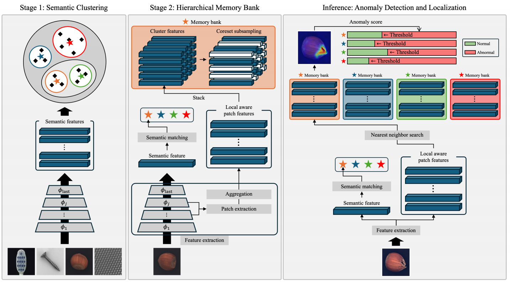
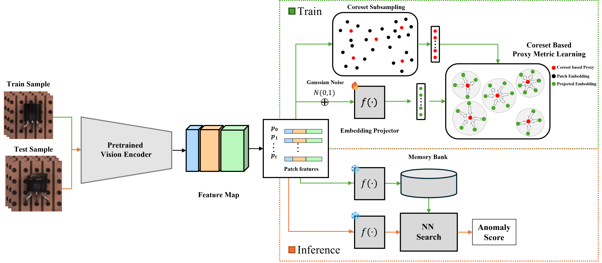
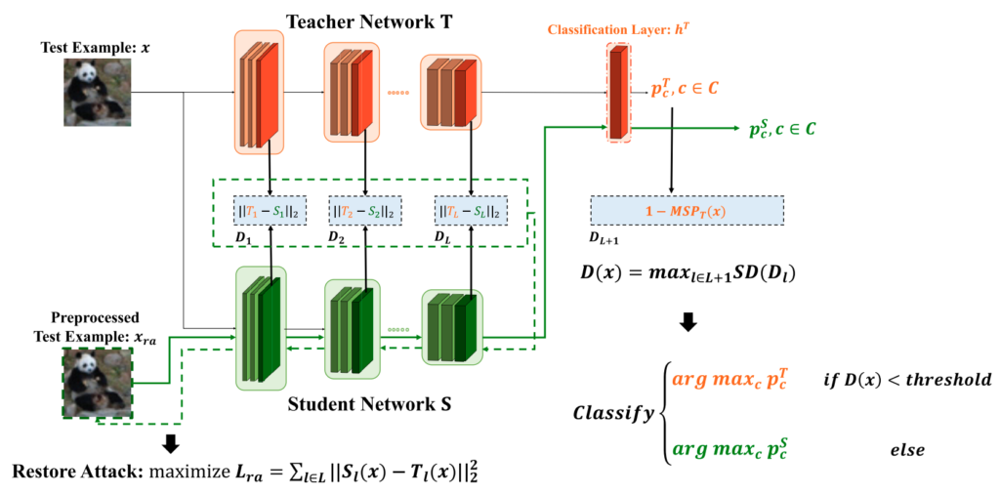
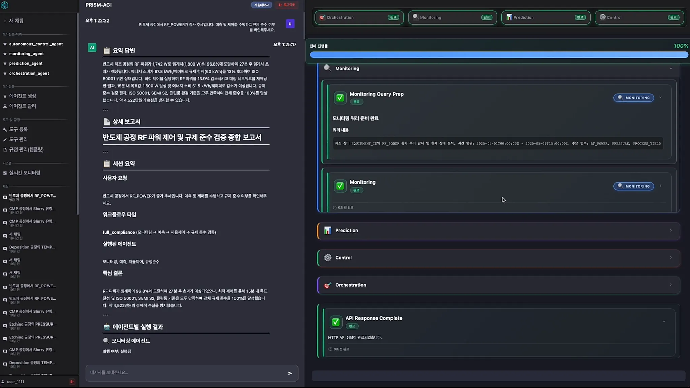
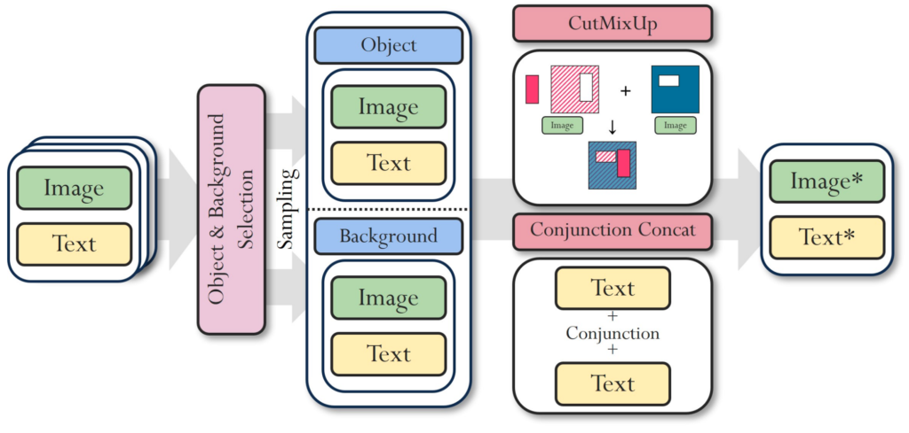
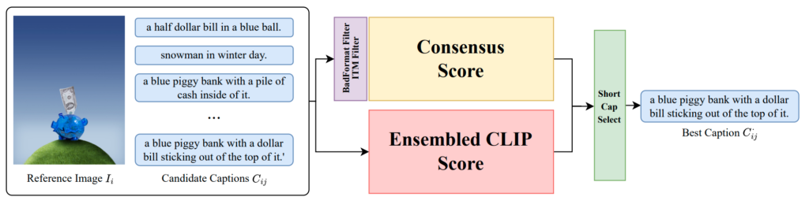

# Key word 정리

상위 카테고리 1: CV (이준기)

- 강건한 모델 학습 (Robust Industrial Perception)
- 이상 탐지 (Anomaly Detection)
- 지식 기반 이상 탐지 및 추리 (Knowledge-based Outlier Detection & Reasoning)
- paper description
    - Jaehyuk Heo, Pilsung Kang*. (2026). Multi-class Image Anomaly Detection for Practical Applications: Requirements and Robust Solutions. Neurocomputing, 671, 132660.
        
        
        
        - 본 논문에서는 실제 산업 환경에서 요구되는 multi-class image anomaly detection을 위해, 클래스 라벨이 없는 상황에서도 학습과 성능 유지가 가능한 semantic-aware anomaly detection 프레임워크인 HierCore를 제안합니다. HierCore는 의미론적 특징 기반의 클러스터링을 통해 클래스를 추정하고, 이미지 패치 특징을 계층적 메모리 구조에 저장함으로써 클래스 라벨에 강건한 다중 클래스 이상 탐지를 가능하게 합니다.
        
        ### 방법론 설명:
        
        - **Semantic Clustering**
            - 훈련 단계에서 입력 이미지의 semantic embedding을 활용하여 이미지 간 의미적 유사도를 계산
            - 가장 가능성이 높은 클래스를 추정하여 해당 이미지를 대응되는 메모리 뱅크에 할당함으로써, 명시적 라벨 없이 클래스 분리 효과를 달성
        - **Hierarchical Memory Bank**
            - 정상 이미지의 지역적 패치 특징을 클래스별로 구성된 계층적 메모리 뱅크에 저장
            - 전역 semantic 정보와 국소 시각 패턴을 함께 고려하여, 클래스 간 특징 중첩 상황에서도 대표적인 정상 패턴을 안정적으로 모델링
        - **Anomaly Scoring**
            - 입력 이미지의 패치 특징을 메모리 뱅크에 저장된 정상 패턴과 비교하여 이상 점수를 계산
            - 클래스 추정 오류나 클래스 간 유사성이 존재하더라도 강건한 이상 탐지 가능하도록 설계
        
        ### 주요 기여:
        
        - **Multi-class unsupervised image anomaly detection을 위한 두 가지 핵심 요구사항 정의**
            - 학습 및 평가 단계에서 클래스 정보 사용 여부에 따라 모델이 충족해야 할 실용적 요구사항을 체계적으로 정리
        - **현실적인 4가지 시나리오에서 기존 방법 재평가**
            - 네 개의 산업용 벤치마크 데이터셋을 활용하여, 기존 방법들이 실제 적용 요구사항을 만족하는지 종합적으로 분석
        - **Semantic-aware hierarchical memory bank 기반 HierCore 제안**
            - 클래스 라벨이 없는 환경을 포함한 모든 시나리오에서 안정적인 성능을 유지하는 이상 탐지 프레임워크 제시
        - **클래스 라벨 의존성을 최소화한 robust anomaly detection 성능 달성**
            - 클래스 수 증가 및 클래스 간 시각적 유사성이 높은 환경에서도 강건한 이상 탐지 성능을 입증
    - Hun Im, Pilsung Kang. (2026). Patch-level proxy metric learning with coresets for precise anomaly localization, Engineering Applications of Artificial Intelligence, 163, 113094.
        - 본 논문에서는 기존 anomaly detection 방법들이 이상 위치의 정밀도 부족 문제를 가진다는 점을 지적하고, 이를 해결하기 위해 patch-level proxy metric learning과 coreset 기반 메모리 압축을 결합한 anomaly localization 프레임워크를 제안합니닫. 제안 방법은 정상 패치 간 거리 구조를 명시적으로 학습하여, 미세한 이상 영역까지 정밀하게 탐지할 수 있습니다
            
            
            
        
        ### 방법론 설명:
        
        - **Patch-level Anomaly Localization 문제 정의**
            - 이미지 단위 anomaly score는 정확하지만, 패치 단위 이상 위치 추정은 부정확한 기존 방법들의 한계를 분석
            - 단순 최근접 거리 기반 방식이 패치 간 의미적 관계를 충분히 반영하지 못함을 지적
        - **Proxy-based Metric Learning**
            - 정상 패치의 대표적인 중심 역할을 하는 **proxy embeddings**를 학습
            - 패치–패치 간 직접 비교 대신, 패치–proxy 간 거리 기반 학습을 통해 안정적인 metric space 구성
            - intra-class compactness와 inter-pattern separability를 동시에 강화
        - **Coreset 기반 정상 패치 메모리 구성**
            - 대규모 정상 패치 메모리를 그대로 사용하는 대신, 핵심 패치만을 선택하는 coreset 전략 적용
            - 메모리 효율성을 유지하면서도 정상 분포의 다양성을 보존
        - **Precise Anomaly Scoring**
            - 테스트 이미지의 패치 특징을 proxy 및 coreset 메모리와 비교하여 anomaly score 산출
            - 미세한 텍스처 변화나 국소적 결함도 효과적으로 강조되도록 설계
        
        ---
        
        ### 주요 기여:
        
        - **Patch-level anomaly localization 성능 향상을 위한 새로운 문제 설정**
            - 이미지 단위 탐지를 넘어, 정밀한 이상 위치 추정에 초점을 맞춘 접근 제안
        - **Proxy metric learning을 anomaly detection에 도입**
            - 패치 간 거리 학습을 명시적으로 수행하여 기존 거리 기반 방법의 한계를 극복
        - **Coreset 기반 메모리 압축과 성능의 균형 달성**
            - 계산 효율성과 localization 정확도를 동시에 만족하는 메모리 구성 전략 제시
        - **산업용 anomaly detection 데이터셋에서의 정밀 localization 성능 검증**
            - 다양한 결함 유형과 해상도 환경에서 제안 방법의 실용성과 효과 입증
    - Kyoungchan Park, Pilsung Kang*. (2024). Detection and Defense: Student-Teacher Network for Adversarial Robustness. IEEE Access, 12, 82742-82752.

        

        본 논문은 적대적 공격(adversarial attack)에 대한 신뢰성과 안전성을 보장하기 위해 학생-교사 네트워크(student-teacher network) 기반의 새로운 탐지 및 방어 방법을 제안합니다. 제안된 방법은 적대적 예제(adversarial examples, AEs)와 정상 예제(normal examples, NEs)를 구분하고, 방어 프로세스를 AEs에만 적용하여 NEs에 대한 분류 성능 저하를 최소화합니다.
        
        ### **방법론 설명:**
        
        1. **학생-교사 네트워크를 통한 탐지 및 방어 통합:**
            - 교사 네트워크(Teacher Network)는 분류기 역할을 하며, 학생 네트워크(Student Network)는 교사 네트워크의 왜곡되지 않은 숨겨진 계층(hidden layer) 특징을 예측하도록 학습합니다.
            - 학생 네트워크와 교사 네트워크의 숨겨진 계층 특징 간의 차이를 기반으로 AEs를 탐지하고, AEs에 대해서는 학생 네트워크가 예측한 특징을 사용하여 올바른 분류 결과를 복구합니다.
        2. **복원 공격(Restoration Attack) 기법 도입:**
            - AEs에 대한 방어 성능을 향상시키기 위해 복원 공격이라는 사전 처리 기법을 도입합니다. 복원 공격은 학생 네트워크의 숨겨진 계층 특징을 왜곡된 교사 네트워크의 특징으로부터 멀어지게 하여 AEs의 올바른 분류 결과를 복구할 수 있게 합니다.
        3. **광범위한 실험을 통한 성능 검증:**
            - CIFAR-10, CIFAR-100, TinyImageNet 등의 대표적인 이미지 분류 데이터셋에서 실험을 수행하여 제안된 방법의 우수한 탐지 및 방어 성능을 입증.
        
        ### **주요 기여 (Contributions):**
        
        - **탐지와 방어를 통합한 최초의 방법 제안:**
            - 탐지와 방어를 통합하여 적대적 공격 여부를 인식하고, 탐지된 AEs에 대해서만 방어 프로세스를 적용하여 NEs에 대한 분류 성능 저하를 방지.
        - **복원 공격 기법을 통한 방어 성능 향상:**
            - 복원 공격 기법을 통해 방어 성능을 추가적으로 개선하고, 완전한 화이트박스 공격(white-box attack)에서도 강력한 방어 성능을 달성.
        - **백서 공격에 대한 강력한 성능 입증:**
            - 완전한 화이트박스 공격에서도 높은 탐지 및 방어 성능을 유지하여, 적대적 공격에 대한 강인성을 확인.
        - **실제 데이터셋에서의 우수한 성능:**
            - CIFAR-10, CIFAR-100, TinyImageNet 등 다양한 데이터셋에서 기존의 최신 탐지 및 방어 방법과 비교하여 우수한 성능을 보임.
        
        
        

상위 카테고리 2: TS (김선민_

- 시계열 예측 / 이상 탐지 / 표현 학습 (Forecasting / Anomaly Detection / Representation Learning )
- 분포 변화 대응 (Shift-robust Adaptation)
- 예지 보전 & 설명가능성 (Predictive Maintenance & Interpretabiltiy)
    - **Granularity Fusion Transformer: Learning multi-granularity patterns for time-series forecasting. Knowledge-Based Systems. 2025.**

        Jinwoo Park, Hyeongwon Kang, Seunghun Han, Pilsung Kang*

        
        
        - 본 논문에서는 시계열 예측을 multi-granularity 패턴을 결합하는 Granularity Fusion Transformer (GFT)를 제안합니다. 이 방법은 시계열을 거친 추세(coarse)와 세밀한 변동(fine)으로 나누어 각각의 특성을 학습한 뒤, 두 정보를 효과적으로 융합해 예측 성능을 높이는 것을 목표합니다.
        
        ### 방법론 설명:
        
        - **Granularity 분해 및 fine 패턴 강화**
            - 입력 시계열을 coarse(추세)와 fine(변동)으로 분해
            - fine 성분은 반복되는 패턴을 더 잘 학습할 수 있도록 주기적 구조로 재구성하여, 단기 변동뿐 아니라 반복 구간에서의 패턴 변화까지 담는 표현을 학습
        - **Coarse–fine 융합을 통한 예측**
            - coarse는 전체 맥락(큰 흐름)을 제공하고 fine은 세부 정보를 제공하도록 역할을 분리
            - cross-attention 기반 융합 모듈로 두 표현을 결합해 통합 표현을 만들고, 이를 바탕으로 최종 예측을 수행
        
        ### 주요 기여:
        
        - **Multi-granularity 기반 예측 구조 제안**
            - 추세와 변동을 분리, 학습, 융합하는 방식으로 single-granularity 접근의 한계를 보완
        - **Fine 패턴을 반복 구조 관점에서 강화**
            - Fine 변동을 단순한 단기 변화로만 보지 않고, 주기적 반복 구조를 활용해 더 의미 있는 표현을 학습하도록 구성
        - **Cross-attention 기반 coarse–fine 결합 방식 제안**
            - 전역 패턴(coarse)과 국소 패턴(fine)이 상호보완적으로 작동하도록 결합 구조를 설계
        - **다양한 예측 환경에서의 유효성 제시**
            - 여러 데이터 및 설정에서 제안 방법론의 실용성과 효과를 입증함
- **Multi-task Self-supervised Time-series Representation Learning. Information Sciences. 2024.**

    Heejeong Choi, Pilsung Kang*

    
    
    - 본 논문에서는 시계열 데이터의 분석을 위해 다중 작업 자가 지도 학습(Multi-Task Self-Supervised Learning) 프레임워크를 제안합니다. 이 방법은 시계열 데이터의 다양한 일관성을 학습하여, 다양한 다운스트림 작업(예: 분류, 예측, 이상 탐지)에서 사용될 수 있는 일반적이고 강력한 데이터 표현을 학습합니다.
    
    ### **방법론 설명:**
    
    1. **다중 작업 자가 지도 학습 프레임워크 제안:**
        - 시계열 데이터에서 **맥락적 일관성 (Contextual Consistency)**, **시간적 일관성 (Temporal Consistency)**, **변환 일관성 (Transformation Consistency)**을 통합하여 동시에 학습하는 프레임워크를 개발.
        - 세 가지 일관성에 기반한 대조 학습(Contrastive Learning)을 통해 다양한 시계열 데이터 특성을 포괄적으로 학습.
    2. **불확실성 가중 접근(Uncertainty Weighting Approach):**
        - 여러 대조 손실 함수(Contrastive Loss)를 통합할 때 각 작업의 불확실성을 고려하여 최적화하는 방법을 도입, 이를 통해 다중 작업 학습의 효율성을 극대화.
    
    ### **주요 기여 (Contributions):**
    
    - **다중 일관성을 학습하는 새로운 자가 지도 학습 프레임워크 개발:**
        - 시계열 데이터의 다양한 특성을 포괄적으로 학습하여 여러 다운스트림 작업에서 사용할 수 있는 일반적인 표현을 효과적으로 학습.
    - **다양한 다운스트림 작업에서 성능 향상:**
        - 시계열 분류, 예측, 이상 탐지와 같은 다양한 작업에서 기존 벤치마크 모델들을 능가하는 성능을 입증.
    - **도메인 간 전이 학습(Transfer Learning) 가능성 검증:**
        - 학습된 모델이 서로 다른 도메인 간에 효과적으로 전이될 수 있음을 실험적으로 확인하여 다양한 응용 가능성을 제시.
    - **불확실성 가중 접근의 도입으로 다중 작업 학습의 안정성 향상:**
        - 다양한 대조 학습의 손실을 균형 있게 최적화하여 학습 안정성을 높이고, 효율적인 학습을 달성.
- **Transformer-based Multivariate Time Series Anomaly Detection using Inter-Variable Attention Mechanism. Knowledge-Based Systems. 2024.**

    Hyeongwon Kang, Pilsung Kang*

    
    
    - 이 논문에서는 다변수 시계열 데이터의 이상 탐지를 위해 변수 간 주의 메커니즘을 사용하는 Transformer 기반의 새로운 방법론인 Variable Temporal Transformer (VTT)를 제안합니다. 이 모델은 Transformer의 셀프 어텐션 메커니즘을 활용하여 변수 간 상관관계와 시간적 의존성을 효과적으로 모델링하여 이상을 탐지합니다.
    
    ### **방법론 설명:**
    
    1. **Variable Temporal Transformer (VTT) 제안:**
        - **Temporal Self-Attention**과 **Variable Self-Attention** 메커니즘을 결합하여 다변수 시계열 데이터에서 변수 간 상관관계와 시간적 의존성을 동시에 고려할 수 있는 구조를 설계.
        - 기존의 Transformer 모델의 한계인 변수 간 상관관계 학습 부족 문제를 해결하고자 변수 주의 메커니즘을 추가하여 개선된 모델 성능을 달성.
    2. **재구성 기반 비지도 학습 모델:**
        - 모델이 정상 데이터 분포를 학습하고, 이후 재구성된 데이터와의 차이를 통해 이상 점수를 계산하여 이상 탐지를 수행하는 비지도 학습 방식 채택.
    3. **F1PA%K 지표 사용:**
        - 기존의 Point Adjustment F1 점수의 성능 과대평가 문제를 해결하기 위해 새로 제안된 평가 지표인 F1PA%K를 활용하여 모델 성능을 객관적으로 평가.
    
    ### **주요 기여 (Contributions):**
    
    - **변수 주의 메커니즘 도입:**
        - 기존 Transformer의 시간적 의존성 학습 외에 변수 간의 상관관계를 고려하여 이상 탐지 성능을 크게 향상시킴.
    - **이상 발생 시점과 원인 변수 추정 가능:**
        - 추론 중에 변수 간의 연관 가중치 변화를 추적하여 이상 발생 시점과 원인 변수를 정확히 추정할 수 있는 해석 가능한 모델 개발.
    - **최첨단 성능 달성:**
        - 네 가지 실제 다변수 시계열 데이터셋을 사용한 실험에서 기존의 비지도 학습 기반 이상 탐지 모델들을 능가하는 성능을 입증.
    - **이상 탐지 결과의 해석 가능성 제시:**
        - 원 데이터와 재구성된 데이터의 어텐션 맵을 비교하여 이상 탐지 결과를 해석할 수 있는 모듈을 제안하고, 이를 통해 이상 발생 원인을 이해하고 설명할 수 있는 방법론 제공.

상위 카테고리 3: NLP (박하연)

- LLM 평가 및 정보 검색 (LLM Evaluation System & Information Retrieval)
- AI 안전성 (AI Safety)
- ~~응용 LLM 엔지니어링 (Effective Exploitation for LLM)~~
- LLM 추론 (LLM Reasoning)
- Paper description
    - **UFORank: Unified Framework of Unsupervised Keyphrase Extraction for Long Documents. IEEE ACCESS. 2026**
        - Doyoon Kim, Pilsung Kang*
        
        
        
        본 논문은 긴 문서 내의 핵심 키워드를 추출하기 위해 ‘핵심어구 추출 프레임워크’를 제안합니다. 이 모델은 토픽 중요도, 문서 구조 내의 위치에 기반한 어구의 가중치, 어구-토픽 유사도를 모두 고려하여 문서의 핵심 내용을 나타내는 키프레이즈를 추출합니다.
        
        ### 방법론 설명:
        
        1. **주제 중요도 고려**
            - 긴 문서 내에 포함되어 있는 다양한 주제를 식별하기 위해 후보 구절을 모아 주제의 중요성을 판단.
        2. **위치 편향 가중치 고려**
            - 문서 내에서 구절의 위치와 빈도를 모두 고려한 위치 편향 가중치 사용.
        3. **후보 구 - 주제 간 유사도 평가**
            - 후보 구와 해당 주제 간의 의미적 관련성을 측정.
        4. **BERT-flow 의 사전학습된 모델인 Glow 모델을 사용**
            - 뭉쳐있는 임베딩을 수학적 변환을 통해 표준 정규 분포로 바꾸는 과정을 거침으로써 구문과 문서 임베딩의 의미적 품질을 향상.
        
        ### 주요 기여:
        
        - **긴 문서에 최적화된 Unsupervised key phrase 추출 프레임워크 제안**
            - 주제 중요도, 위치 편향 가중치, 후보 구-주제 간 유사도를 기반으로 긴 문서에서 효과적으로 키프레이즈를 추출.
        - **긴 문서 요약 작업 데이터셋에서 우수한 성능**
            - SemEval2010, NUS, Krapivin을 포함한 긴 문서 데이터셋에서 공개된 최신 모델 대비 가장 우수한 성능을 보임
        
    - **CEREAL: personality-driven LLM-based conversational recommendation dataset with contextually-enriched and realistic user interactions. Multimedia Tools and Applications. 2026**
        - Jiyoon Lee, Joonghoon Kim, Pilsung Kang*
        
        본 연구는 대화형 추천 시스템 학습을 위한 새로운 데이터셋인 CeReal 을 제안합니다. CeReal 데이터셋은 영화 추천에 필요한 (1) 사용자 정보, (2) 동영상 정보, (3) 성격 정보를 포함하여 대화형 추천 시스템의 발전에 기여합니다.
        
        
        
        ### 방법론 설명:
        
        1. **데이터셋 통합**
            - 실제 영화 시청기록 데이터와 평점, IMDb 메타데이터 중 완전한 데이터만을 추출하여 영화 도메인의 사용자 추천 시스템 데이터셋인 CeReal 을 구축함.
        2. **사용자 성격 분류**
            - 사용자의 성격을 5가지(개방성, 성실성, 외향성, 친화성, 신경증적)로 분류하여 사용자의 특성을 파악.
        3. **LLM 기반 응답 생성**
            - 사용자의 영화 시청 기록 및 성격 및 자연스러운 채팅을 위한 주제에서 벗어난 이야기 장려를 프롬프트에 반영하여 자연스러운 사용자 맞춤형 응답을 생성.
        
        ### 주요 기여:
        
        - **추천의 근거 제시**
            - 추천의 근거를 제시하여 추천 시스템에 대한 사용자의 신뢰도를 높임.
        - **사용자 성격 중심 대화**
            - 5가지 사용자 성격 특성을 기반으로 답변을 제공하여 사용자와 신뢰를 쌓고, 개인화된 추천에 대한 수용도를 높임.
        - **자연스러운 상호작용**
            - LLM 을 기반으로 자연스러운 대화를 생성하여 사용자가 추가적인 정보를 편안하게 공유하도록 유도.
    - **GETUSP: Goal-oriented topic modeling framework for unique selling point discovery. Journal of Retailing and Consumer Services. 2026**
        - Saeran Park, Snagmin Lee, Jiyoon Lee, Minjeoung Ma, Joonghoon Kim and Pilsung Kang*
        
        
        
        이 논문은 제품의 고유한 강점(고유 판매 포인트, USP)을 고객에게 효과적으로 전달하기 위해 리뷰를 클러스터링하여 강점 후보를 추출하고, 이후 경쟁사와의 차별화를 반영해 후보를 정량적으로 평가하는 프레임워크를 제안합니다. 이는 소비자의 니즈에 부합하는 USP를 효과적으로 평가할 수 있도록 합니다.
        
        ### 방법론 설명:
        
        1. **주제 모델링 (Goal Oriented Topic Modeling)**
            - 리뷰를 클러스터링하여 해석이 가능한 문장으로 USP 후보를 선별
        2. **고유 판매 점수(Unique Selling Score) 기반 평가**
            - USP 후보를 ‘고유 판매 점수’ 척도를 활용해 소비자가 인식하는 제품의 강점과 경쟁사와의 차별점을 모두 고려하여 평가
        
        ### 주요 기여:
        
        - **소비자가 느끼는 제품의 핵심 가치를 정량화할 수 있는 기준 제시.**
            - 기업과 소비자의 제품에 대한 인식 간극 원인을 규명하고, 마케팅에 활용될 수 있는 객관적인 측정 기준을 제시.
        - **소비자 경험에 부합하는 USP 추출 자동화**
            - 고객의 리뷰를 활용하여 생산자가 아닌 소비자가 직접적으로 경험한 제품의 고유 강점을 차별성, 긍정성, 탁월성을 기준으로 자동으로 발굴할 수 있는 워크플로우 제시하여 실무에서 활용가능하도록 함.
            
        

상위 카테고리 4: Agentic AI (김선민)

- 내용
    
    **Agentic AI**는 단순한 데이터 처리를 넘어, 제조 현장의 복잡한 상황을 스스로 이해하고 최적의 대응책을 실행하는 **'현장 작업자 친화적'** 기술을 지향합니다. 파편화된 공정 데이터를 유기적으로 통합하고 지능적인 오케스트레이션을 통해 생산 현장의 자율성을 극대화합니다.
    
    - **Figure (아래 그림은 너무 복잡해서, 위 그림 사용)**
        
        
        
        
        
    - **시연 자료**

        

    - **시연 예시**

        

    ### 1. 데이터 분석 에이전트 (Data Analysis Agents)
    
    제조 공정 전반의 데이터를 실시간으로 감시하고, 미래의 잠재적 위험을 선제적으로 파악합니다.
    
    - **실시간 이상 징후 탐지:** 공정 데이터 내의 미세한 변화를 실시간으로 포착하여 이상 상황 발생을 신속하게 식별
    - **멀티모달 통합 분석:** 시계열, 이미지, 텍스트 등 제조 현장의 다양한 데이터를 통합적으로 처리하여 분석의 정밀도를 높임
    - **선제적 위험 예측:** 현재의 공정 상태를 바탕으로 미래에 발생할 수 있는 품질 변동이나 장비 고장 가능성을 예측
    - **설명 가능한 분석 결과 제공:** 인공지능이 특정 상황을 왜 위험으로 판단했는지 작업자가 이해할 수 있는 자연어 형태로 설명을 생성하여 신뢰성을 확보
    
    ### 2. LLM 오케스트레이션 (LLM Orchestration)
    
    다양한 에이전트들이 작업자의 의도에 맞춰 유기적으로 협력할 수 있도록 전체 과업을 조율합니다.
    
    - **자연어 기반 과업 설계:** 현장 작업자의 직관적인 질의를 분석하여 에이전트가 수행 가능한 구체적인 과업으로 변환
    - **에이전트 간 협업 최적화:** 모니터링과 예측, 제어 등 각기 다른 역할을 가진 에이전트 간의 정보를 공유하고 작업 순서를 지능적으로 배분
    - **현장 제약 사항 및 선호도 반영:** 공정의 물리적 제약 조건과 도메인 전문가의 숙련된 노하우를 의사결정 프로세스에 실시간으로 반영
    - **지능형 지식 활용:** 사내 기술 문서나 과거 문제 해결 사례가 담긴 데이터베이스를 탐색하여 현재 상황에 가장 적합한 해결책을 찾아냄
    
    ### 3. 운영 에이전트 (Operational Agents)
    
    분석된 정보를 바탕으로 실제 공정 개선을 위한 최적의 액션을 제안하고 자율적인 제어를 수행합니다.
    
    - **최적 제어 액션 생성:** 공정 상태를 최적화하기 위한 구체적인 제어 변수를 산출하고 실행 가능한 액션 후보군을 제시
    - **자율적 의사결정 및 실행:** 데이터 분석 결과와 환경 변화를 감지하여 인간의 개입을 최소화하면서도 안정적인 공정 운영을 실현
    - **안전성 및 규제 검증:** 제안된 제어 액션이 장비의 한계를 초과하거나 안전 기준을 위배하지 않는지 시뮬레이션을 통해 사전에 검증
    - **물리 법칙 기반 신뢰성 확보:** 실제 공정의 물리적 현상을 반영한 모델을 활용하여 모델의 판단이 현장 상황과 괴리되지 않도록 관리
- 데이터 분석 에이전트 (Data Analysis Agents)
- LLM 오케스트레이션 (LLM Orchestration)
- 운영 에이전트 (Operational Agents)

상위 카테고리 5: Multimodal Model (이준기)

- 비전/시계열-언어 모델 (Vision/Time-series-Language Model)
- 멀티모달 추론 (Multimodal Reasoning)
- 산업 통합 멀티모달 모델 (Unified Multimodal Foundation for Industry)
- paper description
    - Sunwoo Kim+, Hun Im+, Woojun Lee, Seonggye Lee, Pilsung Kang*. (2025). RobustMixGen: Data Augmentation for Enhancing Robustness of Visual-Language Models in the Presence of Distribution Shift. Neurocomputing, 619, 129167. (+: Equally contributed)

        

        본 논문은 분포 변화에 직면한 비전-언어 모델의 강인성을 향상시키기 위해 새로운 데이터 증강 기법인 RobustMixGen을 제안합니다. 이 기법은 이미지와 텍스트 콘텐츠를 동시에 고려하여 데이터 증강을 수행함으로써 기존의 MixGen 기법의 한계를 극복하고, 모델이 분포 변화와 노이즈에 더 강력하게 대처할 수 있도록 합니다.
        
        ### **방법론 설명:**
        
        1. **RobustMixGen 데이터 증강 기법 제안:**
            - 객체와 배경을 사전에 분리하고, 이를 활용하여 이미지와 텍스트를 합성하는 새로운 데이터 증강 기법을 제안.
            - 이미지 합성을 위해 CutMixUp 방식을, 텍스트 합성을 위해 Conjunction Concat 방식을 도입하여 이미지와 텍스트 간의 의미적 관계를 유지함.
        2. **모달리티 특화 고려:**
            - 객체와 배경 클래스를 미리 분류하여, 이미지와 텍스트가 의미적으로 잘 맞도록 증강. 이를 통해 모델이 잘못된 상관관계에 의존하지 않도록 유도.
        3. **성능 검증:**
            - 이미지 검색 과제에서 기존 모델 대비 Recall@K 평균이 0.21% 향상되었음을 입증. 분포 변화 시나리오 하에서는 이미지 및 텍스트 노이즈에 대해 각각 17.11%와 2.77%의 성능 향상을 보여 더 강력한 데이터 증강 기법임을 입증.
        
        ### **주요 기여 (Contributions):**
        
        - **새로운 멀티모달 데이터 증강 기법 제안:**
            - 기존의 MixGen 기법이 가진 문제점(즉, 잘못된 상관관계)에 대응하여 이미지와 텍스트의 의미적 일치를 유지하는 데이터 증강 방법을 제시.
        - **잘못된 상관관계 완화 및 강인성 향상:**
            - 이미지와 텍스트의 의미적 관계를 유지하여 모델이 잘못된 상관관계에 의존하는 것을 방지하고, 분포 변화에 대한 강인성을 크게 개선.
        - **실제 데이터 시나리오에서의 강력한 성능 입증:**
            - 다양한 노이즈 유형(이미지와 텍스트) 하에서 기존 데이터 증강 방법보다 현저히 향상된 성능을 보이며, 실제 응용에 적합한 강력한 데이터 증강 기법으로서의 가능성을 확인.
    - Kiyoon Jeong, Woojun Lee, Woongchan Nam, Minjeong Ma, Pilsung Kang*. (2024). Caption Re-ranking Evaluation Using Ensembled CLIP and Consensus Scores. (1st prize) Caption Re-ranking Topic, NICE Workshop, CVPR.

        

        본 논문은 이미지 캡션의 정확성과 표현력을 평가하고 순위를 매기기 위한 새로운 프레임워크인 ECO(Ensembled CLIP and Consensus Scores)를 제안합니다. ECO는 이미지와 캡션 사이의 의미적 일치도와 캡션의 필수성을 동시에 고려하여 가장 적합한 캡션을 선택하는 방법론입니다. 이 프레임워크는 CVPR 2024의 NICE Challenge에서 우수한 성과를 보였습니다.
        
        ### **방법론 설명:**
        
        1. **ECO 프레임워크 구성:**
            - **Ensembled CLIP Score:** 다양한 사전 학습된 CLIP 모델을 사용하여 이미지와 캡션 간의 코사인 유사도를 계산하고, 이를 결합하여 보다 견고한 의미적 일치 점수를 생성.
            - **Consensus Score:** 캡션 후보군 내에서 자주 사용되는 필수 표현을 측정하여, 필수적인 표현만을 포함하는 캡션을 선택하도록 유도.
        2. **캡션 필터링 기법 적용:**
            - 두 가지 필터(형식 필터 및 ITM 필터)를 적용하여 품질이 낮거나 이미지와 관련이 적은 캡션을 걸러내고, 높은 품질의 캡션만을 평가 대상으로 삼음.
        3. **최종 캡션 선택:**
            - 종합 점수를 기반으로 최적의 캡션을 선택하며, 상위 두 캡션 간 점수 차이가 작을 경우 더 짧은 캡션을 최종 선택.
        
        ### **주요 기여 (Contributions):**
        
        - **통합된 캡션 평가 프레임워크 제안:**
            - ECO는 이미지-캡션의 의미적 일치도와 필수성을 모두 반영하여 다양한 기준에서 우수한 캡션을 선택할 수 있는 통합된 평가 방법론을 제공.
        - **NICE Challenge에서 성과 입증:**
            - CIDEr, SPICE, METEOR, ROUGE-L, BLEU 등의 다양한 평가 지표에서 상위 성적을 기록하며, 제안된 프레임워크의 효과성과 다재다능함을 입증.
        - **캡션 필터링을 통한 평가 정확도 향상:**
            - ITM 필터와 형식 필터를 도입하여 캡션 후보군의 품질을 높이고, 이를 통해 보다 신뢰할 수 있는 평가 결과를 도출.
        - **효과적인 캡션 선택 전략 개발:**
            - 최종 점수가 비슷한 경우 더 짧은 캡션을 선택함으로써, 간결하고 필수적인 표현을 강조하는 평가 전략을 제안.

상위 카테고리 6: 산업인공지능(Industrial AI) (박하연)

- 산업 이상치 탐지(Industrial Anomaly Detection)
- 자율제조 (Autonomous Manufacturing)
- 피지컬 AI (Physical AI)
- paper description
    - [Jaehyuk Heo, Jeongseob Kim, Euisuk Chung, Subin Kim, Pilsung Kang, Donghwa Shin, Jinho Shin, Daehee Han*. (2025). Normalizing flow-based latent space mapping for implicit pattern authentication on mobile devices. Applied Soft Computing, 169, 112469.](https://www.sciencedirect.com/science/article/abs/pii/S1568494624012432)
        
        
        
        본 논문은 모바일 기기의 보안 강화를 위해 Normalizing Flow 를 활용하여 사용자별 잠재 공간 매핑 기반의 Behavior-based Authentication 방법론을 제안합니다. 특히, 기존 모델이 해결하기 어려웠던 랜덤 배치 PIN 패드 환경 상에서도 사용자의 고유 입력 패턴을 효과적으로 추출할 수 있습니다.
        
        ### 방법론 설명:
        
        1. **Normalizing flow 기반 잠재 공간 매핑**
            - 사용자들이 PIN 패드에 입력하는 복잡한 패턴을 단순한 분포 함수를 가진 잠재 공간으로 매핑
        2. **One-class classifier 로 사용자 분류**
            - k-NN, LOF, Forest, one-class SVM 모델을 사용하여 매핑되었던 잠재 공간을 기반으로 효과적으로 사용자를 인증
        
        ### 주요 기여:
        
        - **무작위 PIN 패드 기반 인증 방법론 도입**
            - 무작위 PIN 패드 기반 사용자 인증 방식을 제안하여 고가의 생체 신호 장비 없이 개인의 특성을 잠재 공간에 매핑할 수 있는 방법론 도입
        - **단일 클래스 분류 프레임워크 제안**
            - 단일 사용자와 여러 외부 침입자를 효과적으로 구분
        - **실제 데이터를 활용한 성능 검증**
            - 모바일 뱅킹 서비스 사용자의 무작위 PIN 패드 패턴 데이터셋에서 우수한 성능
        
    - FINALE : Finance Domain Instruction-Tuning Dataset with High-Quality
    Rationales via Chain-of-Thought Prompting
        
        
        
        본 논문은 금융 분야 언어모델의 답변 신뢰성을 높이기 위해 사고 사슬(CoT) 기반의 고품질 근거가 포함된 지시어 튜닝 데이터셋인 **FINALE**을 제안합니다.
        이 데이터셋으로 학습된 모델은 기존 방식 대비 추론 성능과 사용자의 이해도를 높였습니다.
        
        ### 방법론 설명:
        
        1. **고품질 시드 근거 생성**
            - LLM을 활용해 데이터 생성의 기준이 될 시드 데이터를 구축.
            - 데이터의 다양성과 품질을 기준으로 연구자가 검토 및 선별
        2. **Dynamically generating rationales**
            - 시드 데이터를 기반으로 Gemini-Pro를 활용해 근거 데이터셋을 생성
            - 맥락과 지시어의 조합을 고려하여 작성한 프롬프트를 사용해 다양성 확보
        3. **Quality Filtering**
            
            자동 필터링 기법을 통해 모델이 생성한 근거 내의 답변이 실제 정답과 완벽히 일치하는 고품질의 사례만을 최종 데이터셋으로 추출
            
        
        ### 주요 기여:
        
        - **금융 도메인 고품질 데이터셋 FINANCE**
            - 금융 도메인 LLM이 단순 정답을 넘어, 논리적 근거가 포함된 설명력 있는 답변을 생성하도록 학습시키는 고품질 근거 데이터셋 **FINANCE** 구축
        - **효율적인 근거 생성 파이프라인 제안**
            - 인간의 개입을 최소화하면서도 고품질 데이터를 대량으로 확보할 수 있는 자동화 파이프라인 설계
        - **CoT를 활용하여 우수한 성능**
            - CoT 를 활용하여 최종 답변의 정확도 향상
            - 금융 도메인에서의 CoT 학습에 성능 향상에 유효함을 최초로 입증
        - **답변 신뢰성 증가**
            - Human Evaluation 결과, 기존 모델 대비 선호도 4배 향상
            - 고품질 근거 기반 학습이 모델의 신뢰성을 강화함을 입증
        

상위 카테고리 7: Efficient AI

- 경량 모델링 (Light-weight Deep Learning)
- 효율적 추론 (Efficient Inference)
- 확장 및 배포 가능한 AI (Scalable & Deployable AI)
- paper description
    - [Woojun Lee, Pilsung Kang. (2026). Memory Bank-Guided Diffusion Model for Lightweight Anomaly Detection, Applied Soft Computing, 186, 114215.](https://www.sciencedirect.com/science/article/pii/S1568494625015285) (이준기)
        
        
        
        - 본 논문에서는 기존 diffusion 기반 anomaly detection 방법들이 높은 연산 비용과 무거운 모델 구조로 인해 실제 적용이 어렵다는 한계를 지적하고, 이를 해결하기 위해 memory bank로 diffusion 과정을 유도하는 lightweight anomaly detection 프레임워크를 제안합니다. 정상 패턴 정보를 메모리 뱅크에 압축 저장하고, 이를 diffusion 모델의 생성 과정에 활용함으로써 효율적이면서도 정확한 이상 탐지를 합니다.
        
        ### 방법론 설명:
        
        - **Diffusion-based Anomaly Detection의 한계 분석**
            - 고품질 복원을 위해 많은 diffusion step과 대규모 네트워크가 필요함을 지적
            - 실제 산업 환경에서의 실시간성·경량화 요구와의 괴리 문제를 제시
        - **Memory Bank 구성**
            - 정상 이미지에서 추출한 핵심 특징을 memory bank에 저장
            - 정상 데이터 분포의 대표 패턴만을 유지하여 계산 효율성 확보
        - **Memory Bank-Guided Diffusion**
            - diffusion 복원 과정에서 완전히 무작위 노이즈 제거가 아닌, memory bank의 정상 특징을 가이드로 활용
            - 정상 패턴 방향으로의 복원을 유도하여 diffusion step 수를 크게 감소
        - **Lightweight Anomaly Scoring**
            - 복원된 이미지와 입력 이미지 간 차이를 기반으로 anomaly score 산출
            - 메모리 기반 가이던스를 통해 작은 결함도 안정적으로 강조
        
        ---
        
        ### 주요 기여:
        
        - **경량화된 diffusion 기반 anomaly detection 프레임워크 제안**
            - memory bank를 활용해 diffusion 모델의 계산 비용을 효과적으로 감소
        - **Memory-guided diffusion이라는 새로운 결합 방식 제시**
            - 생성 모델과 메모리 기반 방법의 장점을 결합한 구조 설계
        - **실제 적용을 고려한 효율–성능 균형 달성**
            - 연산량을 크게 줄이면서도 기존 diffusion 기반 방법과 경쟁력 있는 성능 확보
        - **다양한 산업용 anomaly detection 데이터셋에서의 실험적 검증**
            - 정확도뿐 아니라 경량성 측면에서의 실용성 입증
    - [Jaewon Cheon, Pilsung Kang. (2025). COUNTDOWN: Contextually Sparse Activation Filtering Out Unnecessary Weights in Down Projection. EMNLP 2025 Main paper.](https://arxiv.org/abs/2505.17701) (김선민)
        
        
        
        - 본 논문에서는 대형 언어 모델(LLM)의 Feed-Forward Network 출력을 down projection에서 여러 성분의 결합으로 생성되는 구조로 재해석합니다. 이를 통해, 최종 출력에 실제로 기여하는 성분만 선택적으로 계산하는 COUNTDOWN 프레임워크를 제안합니다. 제안 방법론은 실용성과 정확도에 따라 M-COUNTDOWN과 D-COUNTDOWN로 나뉘며, 연산량을 크게 줄이면서도 성능을 안정적으로 유지합니다.
        
        ### 방법론 설명:
        
        - **기존 Sparse Activation의 한계 분석**
            - Gated-MLP에서는 게이트 값이 작다고 해서 해당 뉴런의 기여도가 작다고 할 수 없으며, 기존 방식(CATS)의 선택 기준이 부정확해질 수 있음을 지적
        - **출력 기여도 기반 선택 (COUNTDOWN)**
            - FFN을 최종 출력에 대한 각 성분의 기여 관점에서 해석하고, 기여도가 큰 성분만 선택적으로 계산하도록 설계
        - **M-COUNTDOWN (실용형)**
            - 비교적 쉽게 얻을 수 있는 신호를 이용해 계산할 대상을 선택하는 방식
            - 추가적인 Predictor 없이 적용 가능
        - **D-COUNTDOWN (정확도형)**
            - 정확한 선택을 목표하는 방식
            - 높은 연산 비용을 줄이기 위해, 입력 기반으로 선택 대상을 예측하는 소형 Predictor를 학습하여 근사
        - **실제 추론 속도까지 고려한 구현**
            - 연산량 감소가 실제 속도 향상으로 이어지도록 Triton 기반 전용 커널 최적화 제시
        
        ---
        
        ### 주요 기여:
        
        - **새로운 sparse FFN 관점 제시**
            - Activation 크기 대신 최종 출력 기여도를 기준으로 비활성화 대상을 정의
        - **실용형(M-COUNTDOWN)과 정확도형(D-COUNTDOWN) 함께 제안**
            - 별도의 Predictor 없이 바로 적용 가능한 버전과, 소형 Predictor를 통해 보다 정확한 선택을 수행하는 버전을 함께 제안
        - **FFN 연산 절감에도 성능 유지 확인**
            - 이상적인 조건에서 FFN 연산을 최대 90%까지 절감해도 성능 저하가 제한적임을 실험적으로 입증
        - **시스템 관점을 고려한 실용성 확보**
            - 단순한 FLOPs 절감에 그치지 않고, 실제 추론 환경에서의 속도 향상을 목표로 구현